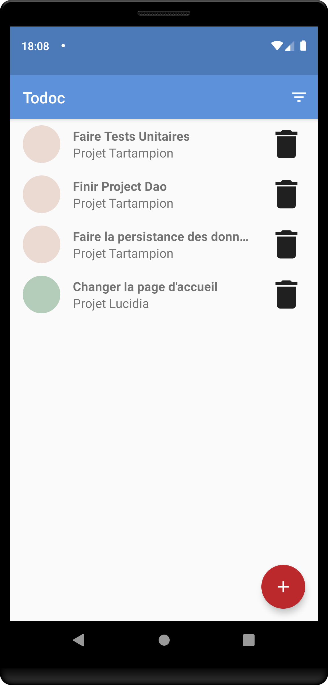

# Todoc

Ce dépôt contient une mini-application pour le P5 du parcours Grande
École du Numérique.

## Introduction

Todoc est une application de gestion de tâches.

## Configurer le projet dans Android Studio
======================================

### 1. Téléchargez le code du projet, de préférence avec git clone.

### 2. Ouvrer Android Studio et cliquer sur "Check out project from Version Control" et cliquer sur Git.
### 3. Coller l'url du dépôt git dans le champ "URL".
### 4. Si besoin, modifier le dossier d'installation du dépôt dans le champ "Directory".

### 5. Synchroniser le projet avec Gradle si besoin en cliquant sur l'icône éléphant.
### 6. Compiler le projet en cliquant sur l'icône marteau.
### 7. Si besoin, séléctionner un appareil android et lancer le projet en cliquant sur l'icône flêche verte.

### 8. Profiter du projet et n'hésiter pas à contribuer ou à faire part d'un bug sur le dépôt Github du projet.
